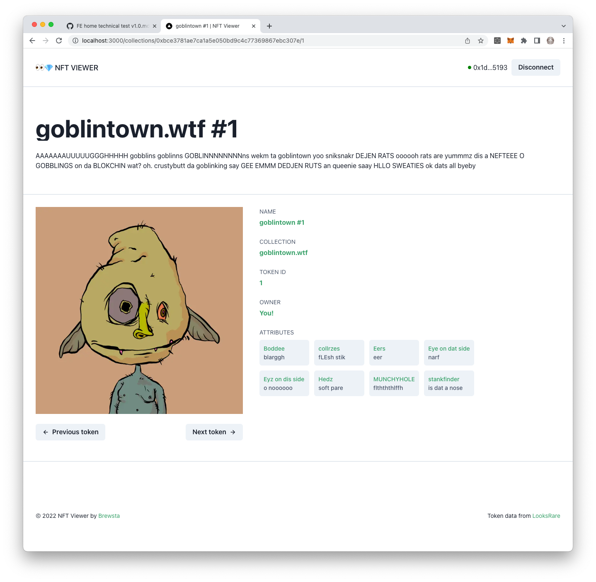

# NFT Viewer

This repository contains the code base for a simple NFT viewing app that leverages [LooksRare](https://looksrare.org/)'s GraphQL API.



## Getting Started

1. Install the app's dependencies:

```bash
yarn install
```

2. Run the local development server:

```bash
yarn dev
```

3. Open [http://localhost:3000](http://localhost:3000) with your browser to see the app in action

## Live App

This app is also deployed to [Vercel](https://nft-viewer-blond.vercel.app/) for ease of viewing.
